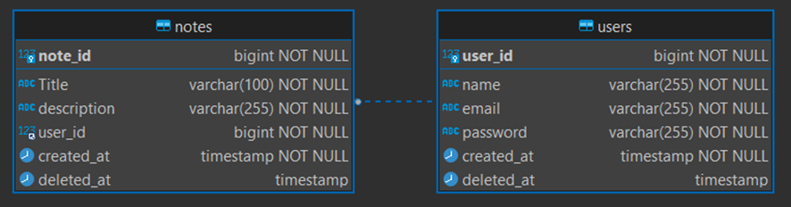

# High-level design

---

#### This web app will allow the user manage notes when he is logged in, and will follow the above rules.

* The note app must run in a cliente browser

* The user must register to use the app

* The register page will have:

     * A form to ask for e-mail, name and a password, and all fields are mandatory	
     * A button to confirm registration
     * If the user type na invalid information in the form, an error message will appear and the form will be marked red

* The user must log in to use the app
* The user can later, change his own information ( Name, email and password)
* The note must have a title
* The note body can be empty
  * When logged in, the user note page will have the following:
  * A button to create a new note
  * A list of previous saved notes, showing the title
  * The list of note will load more when scrolling down
  * Each saved notes will have the option to edit or delete or visualize
  * When visualizing the note, it will open in a side window with the current note info

* When creating a new note, the user will be able to enter a title and a description of the note
* If no title was  added, the save button will be disabled
* When editing the note, the user will be able to see the saved note description and title being able to make changes on the text
* When saving or editting, there is a button to clean title and description
* When delete a note, it will make a soft delete, so the user will have the option to see the previous delete note, being able to recovery the note
* When viewing the deleted notes, the user can remove a note permanently, showing na alert to remind that this action is permanent
* There is a logout button if the user wants to leave the note app page
* All screen must be responsive


# Wireframe

---

When responsive, the list of notes will be a lateral menu, but all the buttons will keep the same

Available on figma

>https://www.figma.com/file/ysH5L0bjvt2FP5JUldEK1P/Feefo-Note-App?node-id=2%3A2&t=7gcpM4PIMvcnoe4W-1


# Data modeling

---

There will be two tables, one for the users and another for notes.



* The user have the following attributes
Name – Max of 255 characteres, and can not be null
  * **Email** - Max of 255 characteres, and can not be null
  * **Creation Date** – Timestamp generated automatically when the user is created
  * **Deletion Date** – Timestamp saved when the user is removed (soft delete)

* The notes have the following attibutes:
  * **Title** - Max of 255 characteres, and can not be null
  * **Description** - Max of 255 characteres, and can not be null
  * **User id** – The id of the user who owns (create) the note
  * **Creation Date** – Timestamp generated automatically when the note is created by user
  * **Deletion Date** – Timestamp saved when the note is removed (soft delete)


# Restful API:

---

## Authentication:

>**LOGIN**: if the user exists, generate a token for authentification
>
>Method: POST
> 
>Route: /auth/login
> 
>Request body:
>```json
>{
> "email": "user email",
> "password": "user password"
>}
>```
>
> Response: 
>```json
>{
> "payload": {
>   "user": {
>     "user_id": 1,
>     "name": "user name",
>     "email": "user email",
>     "created_at": "2022-01-13"
>     },
>   "token": "JWT token",
>   "expiresIn": 123000
> },
> "status_code": 200,
> "error_msg": "message if any error"
>}
>```


## User:

>**CREATE_USER:** create a user
> 
>Method: POST
> 
>Route: /user/create
> 
>Request body:
> 
>```json
>{
> "name": "user name",
> "email": "user email",
> "password": "user password"
>}
>```
>Response:
>
>```json
>{
>"payload": {
>"user_id": 1,
>"name": "user name",
>"email": "user email",
>"created_at": "2022-01-13"
>},
>"status_code": 200,
>"error_msg": "message if any error"
>}
>```

>**GET_USER**: get a user
> 
>Method: GET
> 
>Route: /user/find-user/<user_email>
> 
>Request: string parameter *user_email*
> 
>Response:
>
>```json
>{
> "payload": {
>  "user_id": 1,
>  "name": "user name",
>  "email": "user email",
>  "created_at": "2022-01-13"
> },
> "status_code": 200,
> "error_msg": "message if any error"
>}
>```

>**UPDATE_USER**: update a user
> 
>METHOD: PATCH
> 
>Route: /user/update-user
> 
>Request:
>```json
>{
> "user_id": 1,
> "name": "user name",
> "email": "user email"
>}
>```
>
>Response:
>```json
>{
>"payload": {
>"user_id": 1,
>"name": "user name",
>"email": "user email",
>"created_at": "2022-01-13"
>},
>"status_code": 200,
>"error_msg": "message if any error"
>}
>```

>**DELETE_USER**: Soft delete a user
> 
>METHOD: DELETE
> 
>Route: /user/delete-user/<user_id>
> 
>Request: string parameter *user_email*
> 
>Response:
>```json
>{
> "payload": {
>   "user_id": 1,
>   "name": "user name",
>   "email": "user email",
>   "created_at": "2022-01-13",
>   "deleted_at": "2022-01-13"
> },
> "status_code": 200,
> "error_msg": "message if any error"
>}
>```

## NOTES
>**CREATE_NOTE**: Create a note for the logged user
> 
>Method: POST
> 
>Route: /note/create
> 
>Request body:
> 
>```json
>{
>"title": "note title",
>"description": "note description",
>"user_id": 1
>}
>```
>
>Response:
>
>```json
>{
>"payload":  {
>"title": "note title",
>"description": "note description",
>"created_at": "2022-01-13"
>},
>"status_code": 200,
>"error_msg": "message if any error"
>}
>```

>**GET_NOTE**: get a note by id
> 
>Method: GET
> 
>Route: /note/find-note/<note_id>
> 
>Request: string parameter *note_id*
> 
>Response:
> 
>```json
>{
>"payload": {
>"title": "note title",
>"description": "note description",
>"created_at": "2022-01-13"
>},
>"status_code": 200,
>"error_msg": "message if any error"
>}
>```
>
>**GET_ALL_NOTE***: Get a list of notes from the user
> 
>Method: GET
> 
>Route: /note/find-all-by-user/<user_id>
> 
>Request: string parameter *user_id*
> 
>Response:
> 
>```json
>{
> "payload":[
>   {
>     "title": "note title",
>     "description": "note description",
>     "created_at": "2022-01-13",
>     "status_code": 200,
>     "error_msg": "message if any error"
>   },
>   ⋮
> ],
> "status_code": 200,
> "error_msg": "message if any error"
>}
>```

>**UPDATE_NOTE**: Update a note
> 
>METHOD: PATCH
> 
>Route: /user/update-note
> 
>Request:
> 
>```json
>{
> "note_id": 1,
> "title": "note title",
> "description": "note description"
>}
>```
>
>Response:
> 
>```json
>{
> "payload": {
>   "title": "note title",
>   "description": "note description",
>   "created_at": "2022-01-13"
> },
> "status_code": 200,
> "error_msg": "message if any error"
>}
>```
>
>**DELETE_NOTE**: Delete a note (soft delete)
> 
>METHOD: DELETE
> 
>Route: /user/delete-note/<note_id>
> 
>Request: string parameter *note_id*
> 
>Response:
> 
>```json
>{
> "payload":{
>   "user_id": 1,
>   "name": "user name",
>   "email": "user email",
>   "created_at": "2022-01-13",
>   "deleted_at": "2022-01-13"
> },
> "status_code": 200,
> "error_msg": "message if any error"
>}
>```

>**REMOVE_NOTE**: Remove a note permanently
> 
>METHOD: DELETE
> 
>Route: /user/remove-note/<note_id>
> 
>Request: string parameter *note_id*
> 
>Response:
> 
>```json
>{
> "status_code": 200,
> "error_msg": "message if any error"
>}
>```

# Web Server
All the response will follow a pattern, containing a payload with the retrieve information, the status code and a error message.

>```json
>{
> "payload": { ... },
> "status_code": 200,
> "error_msg": "message if any error"
>}
>```


>Obs: The user can only edit his own note and info, If na attempt to get others user notes or info was made, na error will occur

### The implementation for each route will be done as follows:

1. Authentication route:

      >The login will be made using JWT token and will have na expiration time
   
      >* **LOGIN**: The user sends his email and password and receive the authentication token and users info needed to login.


2. User routes:

   >* **CREATE_USER**: The user inputs information about name, e-mail and password if the e-mail already exists, an errois shown on screen

   >* **GET_USER**: Get information of user by e-mail, retrieving the id, name and e-mail. If the user do not exists, na error will appear

   >* **UPDATE_USER** -> Update information of the user. The request body will have the Id of user to be founded, followed by the new information to be updated (name, email and password)

   >* **DELETE_USER**: Do a soft delete of user by user id, setting the deleted date of the user

3. Note routes:
   >* **CREATE_NOTE**: The user inputs the title and na optional body, when calling the create route, a note will be created and associated to a user
   
   >* **GET_NOTE**: Get a saved note by the note id. The note id can be retrieve calling the route to get all note from the user
   
   >* **GET_ALL_NOTE**: Retrieve all notes saved by the logged user, passing the user id of the logged user.
   
   >* **UPDATE_NOTE**: Update the title or body of a note. The request body will have a mandatory note id, and optional values for title and description. If a null value was send, no updated will be done, but if na empty string was send, the text will be replaced by the empty string.
   
   >* **DELETE_NOTE**: Do a soft delete on a note, by the note id, this way the note will be available to be recovery
   
   >* **REMOVE_NOTE**: Permanently deletes a note by the note id, removing the data from database

